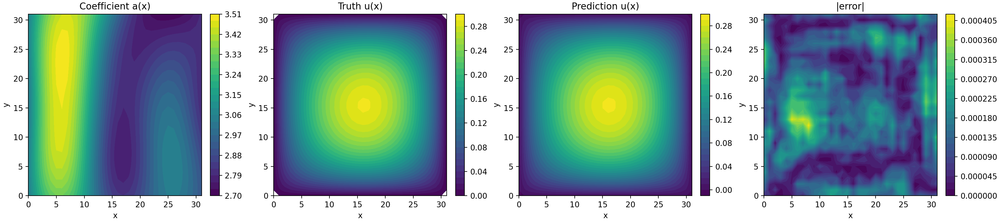
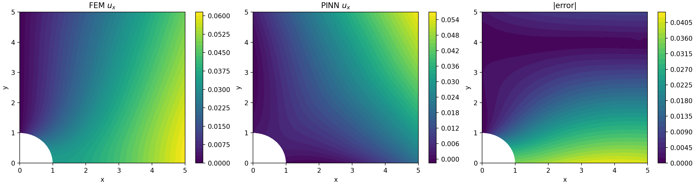
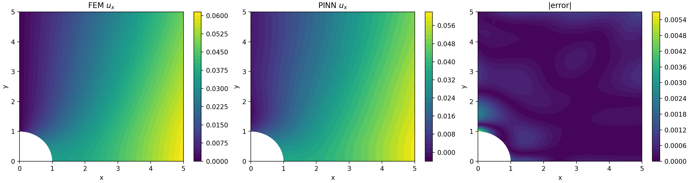
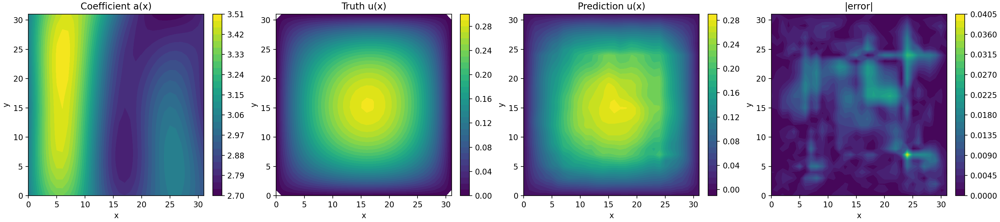

# Physics-Informed & Operator Learning for PDEs


Two ways of learning solutions to PDEs with neural networks, implemented from scratch in PyTorch:

1. **Physics-informed neural networks (PINNs)** that solve a 2D linear-elasticity problem, a plate with a circular hole under tension, using only the governing equations and boundary conditions. A second variant adds 50 sparse displacement measurements.
2. **Neural operators** that learn the map from permeability field to pressure field for **2D Darcy flow**, comparing a plain CNN with a **Fourier Neural Operator (FNO)**.



---

## Results

| Model | Task | Metric | Train | Test |
|---|---|---|---|---|
| CNN | Darcy flow, 32×32 | relative L² error | 4.9 × 10⁻² | 6.1 × 10⁻² |
| **FNO** | Darcy flow, 32×32 | relative L² error | **3.0 × 10⁻³** | **2.1 × 10⁻³** |
| PINN (physics only) | Plate with hole | max \|u<sub>x</sub> − u<sub>x</sub><sup>FEM</sup>\| | — | ≈ 4.2 × 10⁻² |
| **PINN + 50 measurements** | Plate with hole | max \|u<sub>x</sub> − u<sub>x</sub><sup>FEM</sup>\| | — | **≈ 5.6 × 10⁻³** |

All four runs are the final configurations: 200 epochs for the operators, 50 000 Adam iterations for the PINNs. For scale, the FEM displacement u<sub>x</sub> peaks at about 0.06.

**Takeaways**

- On the same data, the FNO has **~30× lower test error** than the CNN. Mixing globally in Fourier space suits the elliptic Darcy operator, where each output value depends on the whole input field.
- The physics-only PINN reaches a low residual loss (~10⁻⁵) but converges to a displacement field that is visibly wrong. It also underestimates the stress concentration at the hole. Adding just 50 measured displacement points anchors the solution and cuts the peak error by **~8×**.

### Plate with a hole: PINN vs FEM

Physics-only PINN:



Data-assisted PINN (50 measurements):



### Darcy flow: CNN baseline



---

## Methods

### Problem 1: PINN for plane-stress elasticity

The domain is a quarter plate with a circular hole, using symmetry boundary conditions. A traction of σ·n = (0.1, 0) is applied on the right edge; the top edge and the hole are traction-free. The material has E = 10 and ν = 0.3.

Two MLPs (3 × 128 hidden units, tanh, float64) are trained jointly:

- `disp_net`: (x, y) → (u<sub>x</sub>, u<sub>y</sub>)
- `stress_net`: (x, y) → (σ<sub>11</sub>, σ<sub>22</sub>, σ<sub>12</sub>)

The loss is a sum of MSE terms, with all derivatives computed by autograd:

- **Constitutive consistency:** `stress_net` must match Hooke's law applied to the strains of `disp_net`, at interior and boundary points.
- **Equilibrium:** ∇·σ = 0.
- **Boundary conditions:** symmetry displacements, applied traction, and a traction-free hole.
- **Measurements** (`PINN_data.py` only): MSE against 50 randomly chosen FEM displacement values, weighted ×100.

Training uses Adam (learning rate 10⁻³) with StepLR (×0.5 every 2000 iterations). Ground truth comes from a MATLAB FE solver meshed with DistMesh.

### Problem 2: operator learning for Darcy flow

The goal is to learn the solution operator 𝒢: a(x) ↦ u(x) of −∇·(a∇u) = f on the unit square. The dataset has 1000 training and 100 test pairs on a 32×32 grid.

- **CNN:** six same-padding convolutions (64 channels, GELU) that map the input to the output at the same resolution.
- **FNO:** lifts (a, x, y) to 32 channels, then applies 4 Fourier layers. Each layer is a spectral convolution keeping the lowest 12×12 modes plus a pointwise channel MLP and a 1×1 skip path. A final MLP projects back to one channel.

Both models use unit-Gaussian input normalisation, a relative L² loss, Adam (learning rate 10⁻³) with StepLR (×0.7 every 50 epochs), and batch size 20.

---

## Repository layout

```
.
├── PINN.py                    # Physics-only PINN (Problem 1)
├── PINN_data.py               # PINN + sparse measurements (Problem 1)
├── Darcy_CNN.py               # CNN operator baseline (Problem 2)
├── Darcy_FNO.py               # Fourier Neural Operator (Problem 2)
├── coursework/
│   ├── pinn.py                # Networks, physics losses, training loop, plotting
│   └── darcy.py               # CNN, FNO, data loading, training loop, plotting
├── Coursework2_Problem_1/     # MATLAB FE solver + DistMesh; generates plate_data.mat
├── Coursework2_Problem_2/     # Place the Darcy .mat datasets here (not tracked)
└── assets/                    # Figures used in this README
```

## Getting started

Dependencies are managed with [uv](https://docs.astral.sh/uv/):

```bash
uv sync
```

**Data**

- *Plate problem:* `Coursework2_Problem_1/plate_data.mat` is included. To regenerate it, run `Coursework2_Problem_1/Plate_hole.m` in MATLAB.
- *Darcy flow:* the datasets came with the course and are not redistributed here. Place `Darcy_2D_data_train.mat` and `Darcy_2D_data_test.mat` in `Coursework2_Problem_2/`. They are HDF5 `.mat` files with 32×32×N `a_field` and `u_field` arrays.

**Train**

```bash
uv run PINN.py --iterations 50000
uv run PINN_data.py --iterations 50000 --measurement-weight 100
uv run Darcy_CNN.py --epochs 200
uv run Darcy_FNO.py --epochs 200 --modes 12 --width 32
```

Each script writes its loss curves, prediction plots, a CSV history and checkpoints to `outputs/<run>/`. Pass `--resume-from outputs/<run>/checkpoint_latest.pt` to continue a run, and `--help` to list all options. Training uses CUDA when it is available.

---

## Acknowledgements

- Developed for coursework in **4C11 Data-Driven and Learning-Based Methods in Mechanics and Materials**, Department of Engineering, University of Cambridge. The problem setup, FE solver scaffolding and datasets were provided by the course.
- [DistMesh](http://persson.berkeley.edu/distmesh/) © Per-Olof Persson, GPL v2+. It is vendored unmodified in `Coursework2_Problem_1/distmesh/` under its own licence.
- FNO architecture after Li et al., [*Fourier Neural Operator for Parametric Partial Differential Equations*](https://arxiv.org/abs/2010.08895), ICLR 2021.

## License

The code written for this project is licensed under the [MIT License](LICENSE). Third-party components keep their original licences.
